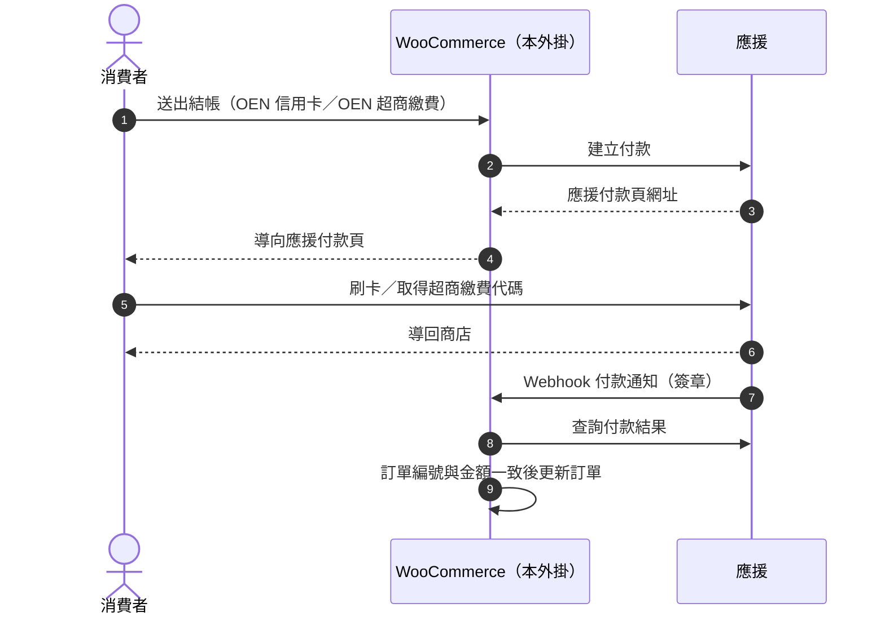

# 應援金流 WooCommerce 外掛

應援科技（Oen Tech）官方的 WooCommerce 金流外掛。安裝後，WooCommerce 商店就能使用**應援金流**收款：消費者在應援付款頁完成信用卡或超商代碼付款，付款結果與超商繳費代碼會自動同步回 WooCommerce 訂單，信用卡訂單可以直接從 WooCommerce 後台退款。

- 設定教學（附操作截圖）：[docs/setup-guide.md](docs/setup-guide.md)
- 常見問題：[docs/faq.md](docs/faq.md)
- 下載：[GitHub Releases](https://github.com/OEN-Tech/woocommerce-oen-payment/releases)
- 更新紀錄：[CHANGELOG.md](CHANGELOG.md)
- 應援金流介紹：[oen.tw/product/payments](https://oen.tw/product/payments)
- 申請應援商店：[oen.tw/contact](https://oen.tw/contact)

## 目錄

**使用外掛**

- [關於應援金流](#關於應援金流)
- [支付方式與功能](#支付方式與功能)
- [使用前須知](#使用前須知)
- [開始之前](#開始之前)
- [系統需求](#系統需求)
- [安裝](#安裝)
- [快速設定](#快速設定)
- [設定說明](#設定說明)
- [付款與訂單狀態](#付款與訂單狀態)
- [超商繳費代碼](#超商繳費代碼)
- [退款](#退款)
- [傳送給應援的資料](#傳送給應援的資料)
- [更新紀錄](#更新紀錄)
- [取得協助](#取得協助)

**開發者參考**

- [串接流程](#串接流程)
- [Gateway ID 與設定 Option](#gateway-id-與設定-option)
- [Webhook 註冊與事件](#webhook-註冊與事件)
- [付款失敗代碼](#付款失敗代碼)
- [超商繳費代碼排程](#超商繳費代碼排程)
- [建立付款時送出的欄位](#建立付款時送出的欄位)
- [訂單 Meta](#訂單-meta)
- [日誌](#日誌)
- [從原始碼安裝](#從原始碼安裝)
- [測試與貢獻](#測試與貢獻)
- [授權](#授權)

## 關於應援金流

應援金流是應援科技的線上金流服務，商家不需要自行對接銀行，帳號開通後即可收款。和這個外掛相關的特點：

- **國際級支付架構**：採用 Visa 旗下的 Cybersource 金流平台，提供 3DS 2.0 驗證與詐欺偵測。
- **資安認證**：通過 PCI DSS Level 1、ISO 27001、ISO 27701 認證。消費者在應援付款頁輸入卡號，WooCommerce 商店不經手任何卡片資料。
- **發票代開**：應援整合金流與稅務，內建個人戶與公司戶發票並代為開立。
- **Webhook 架構**：付款結果由應援主動推送。這個外掛會在儲存設定時自動完成 Webhook 註冊。
- **個人也能申請**：沒有公司行號的創作者、接案者，可用個人名義申請（需身分證與銀行帳戶，經審核通過）。

以上內容整理自[應援科技官網](https://oen.tw)與[應援金流](https://oen.tw/product/payments)介紹頁。

> 應援金流另有定期定額、綁定信用卡、多幣別收款等服務，這個外掛目前只支援**一次性的新台幣付款**。

## 支付方式與功能

| 付款方式 | 結帳頁顯示名稱 | 狀態 | 退款 |
|---|---|---|---|
| 信用卡 | OEN 信用卡 | 可用 | 可從 WooCommerce 後台全額或部分退款 |
| 超商代碼繳費 | OEN 超商繳費 | 可用 | 不支援 |

結帳頁顯示名稱可在 **WooCommerce › 設定 › 付款** 中修改。

- **應援付款頁收款**：消費者在應援付款頁完成付款，付款頁由應援提供與維護。
- **自動連接應援**：儲存設定時，外掛自動向應援註冊 Webhook 並保存簽章密鑰，不需要到應援後台手動設定。
- **付款結果向應援確認**：收到應援的付款通知後，外掛會再向應援查詢，訂單編號與金額都一致才更新訂單。
- **超商繳費代碼同步**：自動向應援取得繳費代碼，顯示在消費者的訂單頁、後台訂單頁與通知信。
- **後台退款**：在 WooCommerce 後台退款會通知應援退款，應援確認後才記錄到 WooCommerce。
- **防止重複付款**：同一張訂單重複送出結帳時，沿用同一筆應援付款；消費者改選另一種應援付款方式時，外掛會取消舊的應援付款。
- **發票**：外掛不傳送、也不儲存任何發票資料。應援提供發票代開服務，透過本外掛成立的交易如何開立發票，請向應援確認。
- 應援測試環境與正式環境一鍵切換。
- 支援傳統結帳頁與區塊結帳（Cart & Checkout Blocks），相容 WooCommerce HPOS（高效能訂單儲存）。

## 使用前須知

- 只支援新台幣（TWD），小數位數必須設為 0。外掛不檢查商店幣別，非 TWD 商店請勿啟用。
- 金額以整數元送出。
- 只有信用卡支援退款。
- 應援金流的定期定額、綁定信用卡、多幣別收款，外掛目前不支援。
- 不支援 ATM 虛擬帳號轉帳。
- 超商繳費代碼以排程查詢取得，需要 WordPress 的排程（WP-Cron）正常執行。
- 外掛不會刪除應援上的 Webhook。變更網站網址後，舊網址的 Webhook 如需移除，請洽應援。
- 停用或刪除外掛不會清除外掛的設定與訂單資料。

## 開始之前

1. **申請應援商店**：到[應援科技官網](https://oen.tw/contact)預約諮詢並申請，公司或個人皆可申請。
2. **取得串接憑證**：在應援後台查看「網域名稱」（即外掛的商店代碼），並在「總設定 › OenPay Embed」產生 Secret Key，步驟見[設定教學](docs/setup-guide.md#步驟-1申請應援商店並取得憑證)。測試環境與正式環境的憑證不同，要和外掛所選的環境對應。Secret Key 等同密碼，請勿外流或出現在截圖中。
3. **確認網站條件**：網站要能從公網連線，應援才能送達付款通知，詳見[系統需求](#系統需求)。
4. **揭露資料傳輸**：外掛會把訂單金額、訂單編號、帳單姓名與 Email、商品明細傳送給應援（詳見[傳送給應援的資料](#傳送給應援的資料)）。請在網站的隱私權政策中說明，並參考應援的[服務條款](https://oen.tw/terms)與[隱私權政策](https://oen.tw/privacy)。

## 系統需求

| 項目 | 需求 |
|---|---|
| WordPress | 6.1 以上 |
| WooCommerce | 8.2 以上 |
| PHP | 8.1 以上 |
| 資料庫 | MySQL／MariaDB |
| 商店幣別 | **新台幣（TWD）**，小數位數必須設為 0。外掛固定以 TWD 整數金額向應援請款，不會換算其他幣別 |
| 網站網址 | WordPress 的網站網址（**設定 › 一般**）必須是應援能連線的公網網址，Webhook 通知網址由它組成。建議使用 HTTPS |
| 對外連線 | 網站要能連線至應援 API |
| 排程 | WP-Cron／Action Scheduler 能正常執行（向應援查詢超商繳費代碼時使用） |

已在 WordPress 7.1.2、WooCommerce 11.1.2、PHP 8.2 測試（區塊結帳、HPOS）。

## 安裝

1. 從 [GitHub Releases](https://github.com/OEN-Tech/woocommerce-oen-payment/releases) 下載最新版的「Source code (zip)」。
2. 解壓縮後，把資料夾（例如 `woocommerce-oen-payment-1.0.4`）改名為 `woocommerce-oen-payment`，再重新壓縮成 ZIP。
3. 到 **外掛 › 安裝外掛 › 上傳外掛**，選擇 ZIP 後按「立即安裝」，完成後按「啟用外掛」。

資料夾名稱要固定為 `woocommerce-oen-payment`，日後上傳新版時 WordPress 才會更新原本的外掛，而不是另外裝一份。

## 快速設定

1. 到 **WooCommerce › 設定 › 一般**，確認貨幣為新台幣（TWD）、小數位數為 0。
2. 到 **WooCommerce › 設定 › OEN**：
   1. 勾選「啟用 OEN 金流付款方式」。
   2. 勾選「OEN 測試環境」。
   3. 填入應援**測試環境**的「商店代碼」（應援後台的「網域名稱」）與「Secret Key」（在應援後台「總設定 › OenPay Embed」產生）。
   4. 儲存。畫面出現「已註冊 OEN Webhook（…）」或「已更新 OEN Webhook（…）」，代表外掛已連上應援，Webhook 與簽章密鑰都已自動設定。
3. 到 **WooCommerce › 設定 › 付款**，啟用「OEN 信用卡」「OEN 超商繳費」。
4. 在應援測試環境各下一筆信用卡與超商繳費訂單，確認訂單狀態依[付款與訂單狀態](#付款與訂單狀態)更新。
5. 正式上線：取消勾選「OEN 測試環境」，換成應援**正式環境**的商店代碼與 Secret Key，**勾選「重新註冊 Webhook」**後儲存。

每個步驟的操作畫面請見[設定教學](docs/setup-guide.md)。

## 設定說明

### WooCommerce › 設定 › OEN

| 設定 | 說明 |
|---|---|
| 啟用 OEN 金流付款方式 | 主開關。關閉時所有應援付款方式都不會出現 |
| 訂單編號前綴 | 加在 WooCommerce 訂單 ID 前面，組成送給應援的訂單編號。訂單 ID 預設與訂單編號相同；使用自訂訂單編號的外掛時，以訂單 ID 為準。**有未付款訂單時請勿更改**：這些訂單再次進入結帳時，會因訂單編號與既有的應援付款不符而被拒絕 |
| 顯示訂單商品名稱 | 送出逐項商品明細，而非單一彙總品項 |
| 在 Email 中顯示付款資訊 | 在訂單通知信加入交易編號、付款時間、超商繳費代碼 |
| OEN 測試環境 | 連線應援測試環境 |
| 商店代碼 | 應援後台的「網域名稱」 |
| Secret Key | 應援後台產生的 Secret Key |
| Webhook Secret | Webhook 簽章密鑰，註冊時自動填入，請留空。沒有這個密鑰時，外掛不會接受應援的退款通知 |
| 重新註冊 Webhook | 一次性勾選，儲存時重新註冊 Webhook 並換新簽章密鑰 |

### WooCommerce › 設定 › 付款 › OEN 信用卡／OEN 超商繳費

| 設定 | 說明 |
|---|---|
| 啟用／停用 | 個別啟用付款方式 |
| 標題 | 結帳頁顯示的付款方式名稱 |
| 說明 | 結帳頁顯示的付款方式說明 |

### 測試環境與正式環境

| 環境 | API Base URL | 切換方式 |
|---|---|---|
| 正式 | `https://api.oen.tw/api` | 不勾選「OEN 測試環境」 |
| 測試 | `https://api.testing.oen.tw/api` | 勾選「OEN 測試環境」 |

- 商店代碼與 Secret Key 皆為必填；任一為空時，結帳頁不會顯示應援付款方式。
- 切換環境時，商店代碼與 Secret Key 要換成該環境的憑證，並勾選「重新註冊 Webhook」重新註冊（Webhook 登記在當下所選的環境）。
- 使用應援測試環境前，請先向應援確認你的測試環境已開通 Hosted Checkout（應援付款頁）。

### Webhook（付款通知網址）

外掛接收應援通知的網址固定為：

```text
https://<你的網站>/?wc-api=oen_payment
```

這個網址由 WordPress 的網站網址組成。網站網址若是內網位址或 `localhost`，應援就無法送達通知。

- 第一次儲存設定時，外掛自動向應援註冊這個網址，並把簽章密鑰存入「Webhook Secret」。之後的一般儲存不會再註冊。
- 切換環境或變更網站網址後，勾選「重新註冊 Webhook」重新儲存。變更網址時，外掛會為新網址另外建立一筆 Webhook。
- 註冊失敗時設定仍會儲存，並在設定頁顯示「OEN Webhook 自動註冊失敗：…」。
- 外掛註冊的 Webhook 不會列在應援後台「OenPay Embed Webhook 健康狀態」的「已註冊的 Webhook」，那裡會顯示「尚未註冊 Webhook」。這不影響付款通知，也不需要在應援後台另外新增 Webhook。詳見 [FAQ](docs/faq.md#應援後台顯示尚未註冊-webhook)。

## 付款與訂單狀態

**信用卡**：選擇「OEN 信用卡」→ 導向應援付款頁 → 刷卡 → 導回商店的「已收到訂單」頁 → 應援通知外掛，外掛向應援查詢確認後更新訂單。

**超商繳費**：選擇「OEN 超商繳費」→ 導向應援付款頁取得繳費代碼 → 消費者到超商繳費 → 應援通知外掛，外掛向應援查詢確認後更新訂單。

| 階段 | OEN 信用卡 | OEN 超商繳費 |
|---|---|---|
| 導向應援付款頁 | 等待付款中 | 保留，避免被 WooCommerce 的保留庫存機制自動取消 |
| 應援確認付款完成 | 處理中 | 處理中 |
| 應援確認付款失敗、逾期或取消 | 失敗 | 失敗 |

只含虛擬且可下載商品的訂單，付款完成後會直接變為「已完成」。

訂單狀態只在外掛向應援查詢確認後才改變，訂單編號與金額都要和訂單一致。消費者回到「已收到訂單」頁本身不會改變訂單狀態。

同一張未付款訂單再次送出結帳時（例如消費者按上一頁後重新付款），外掛會沿用同一筆應援付款。消費者改選另一種應援付款方式（例如從 OEN 信用卡改為 OEN 超商繳費）時，外掛會建立新的應援付款並取消舊的；改選非應援的付款方式時，外掛不會取消舊的應援付款。無法確認既有應援付款的狀態時，外掛會先擋下結帳並顯示錯誤，避免同一張訂單出現兩筆可付款的應援付款。

付款失敗被導回傳統結帳頁時，外掛會顯示失敗原因（例如「信用卡已過期。」「信用額度不足。」），不會把應援的錯誤細節顯示給消費者。

## 超商繳費代碼

超商繳費代碼是消費者在應援付款頁選擇超商繳費後才產生的。外掛在訂單進入「保留」後，約 1、4、14、44 分鐘各向應援查詢一次，共 4 次；取得代碼、付款已結束或次數用完就停止。付款完成時，若查詢結果含繳費資訊，也會一併寫入。

取得後顯示在：

- 消費者：「已收到訂單」頁、我的帳號 › 訂單。
- 商家：後台訂單頁的帳單地址下方。
- 通知信：需勾選「在 Email 中顯示付款資訊」。

繳費期限依網站的時區與日期、時間格式顯示（**設定 › 一般**）。

第一次查詢約在下單後 1 分鐘。所以消費者從應援完成頁按「返回網站」時，「已收到訂單」頁通常還沒有代碼；應援完成頁本身有顯示代碼。

已取得代碼的訂單，超過應援付款頁的付款時限後仍維持「保留」，不會變成「失敗」，消費者可以在繳費期限內繳費。

## 退款

只有 **OEN 信用卡** 訂單支援退款；超商繳費訂單在後台不會出現應援退款按鈕。

1. 在訂單頁按「退費」，輸入金額後按「透過 OEN 信用卡 退款」。金額會四捨五入為整數元，可部分退款。
2. 外掛通知應援退款。
3. 應援確認退款成功，WooCommerce 才會記錄退款；其他結果一律回報錯誤，訂單不會被標記為已退款。

退款後，應援後台的交易明細會顯示「部分退款」或「全額退款」。

> 請不要按「手動退款」。手動退款只會在 WooCommerce 記錄退款，**不會**通知應援把款項退給消費者。

**已在應援後台退款時**：在應援後台退款不會同步到 WooCommerce，訂單狀態與金額不會改變。請在 WooCommerce 訂單按「退費」，輸入相同金額，按「手動退款」補記錄。不要再按「透過 OEN 信用卡 退款」：應援可能回應錯誤，也可能再退一次款給消費者。建議退款都從 WooCommerce 發起，兩邊的紀錄才會一致。

## 傳送給應援的資料

建立應援付款時，外掛會送出：

- 訂單總額（整數，新台幣）與訂單編號（訂單編號前綴＋WooCommerce 訂單 ID）。
- 帳單姓名與 Email。
- 商品明細：未勾選「顯示訂單商品名稱」時為單一品項「{網站名稱} 訂單」；勾選時為逐項商品（SKU 或商品 ID、名稱、數量、含稅單價），另加手續費與運費。
- 付款完成、失敗、取消時要導回的商店頁面網址。
- 退款時：退款金額與你輸入的退費理由。

欄位名稱見開發者參考的[建立付款時送出的欄位](#建立付款時送出的欄位)。

## 更新紀錄

各版本的變更見 [CHANGELOG.md](CHANGELOG.md)，每一版的發布說明也可在 [GitHub Releases](https://github.com/OEN-Tech/woocommerce-oen-payment/releases) 查看。

## 取得協助

- 應援帳號、交易、帳務問題：[應援說明中心](https://oen.tw/support)、客服信箱 [info@oen.tw](mailto:info@oen.tw)、電話 +886 2 2627-8830
- 外掛問題與建議：[GitHub Issues](https://github.com/OEN-Tech/woocommerce-oen-payment/issues)
- 資安問題回報：[應援資安問題回報](https://oen.tw/security/report)

回報外掛問題時，請附上 WordPress、WooCommerce、PHP 與外掛版本，以及問題畫面與 `oen-payment` 開頭的日誌。**請勿在 Issue 中貼上 Secret Key、Webhook Secret 或消費者個人資料。**排查步驟可先參考[常見問題](docs/faq.md)。

---

以下給需要整合、除錯或參與開發的開發者。

## 串接流程



外掛與應援之間的互動：

| 方向 | 用途 | 觸發時機 |
|---|---|---|
| 外掛 → 應援 | 建立付款 | 消費者送出結帳 |
| 外掛 → 應援 | 查詢付款 | 重複結帳、收到 Webhook、取得超商繳費代碼 |
| 外掛 → 應援 | 取消付款 | 消費者改選另一種應援付款方式 |
| 外掛 → 應援 | 建立退款 | 在 WooCommerce 後台對信用卡訂單退款 |
| 外掛 → 應援 | 建立／更新 Webhook、換新簽章密鑰 | 儲存 OEN 設定 |
| 應援 → 外掛 | Webhook 事件 | 付款完成／失敗／逾期／取消、退款 |

訂單狀態轉換用 WooCommerce 的 `payment_complete()`（處理中，或只含虛擬且可下載商品時為已完成）與 `failed`；超商繳費訂單導向應援時設為 `on-hold`。

## Gateway ID 與設定 Option

| 付款方式 | Gateway ID |
|---|---|
| OEN 信用卡 | `oen_credit` |
| OEN 超商繳費 | `oen_cvs` |
| OEN 虛擬帳號轉帳（不會註冊） | `oen_atm` |

| 設定 | Option |
|---|---|
| 啟用 OEN 金流付款方式 | `oen_enabled` |
| 訂單編號前綴 | `oen_order_prefix` |
| 顯示訂單商品名稱 | `oen_display_item_name` |
| 在 Email 中顯示付款資訊 | `oen_show_payment_in_email` |
| OEN 測試環境 | `oen_sandbox` |
| 商店代碼（MerchantID） | `oen_merchant_id` |
| Secret Key | `oen_api_token` |
| Webhook Secret | `oen_webhook_secret` |
| 重新註冊 Webhook | `oen_webhook_reregister` |

## Webhook 註冊與事件

儲存 **WooCommerce › 設定 › OEN** 時，若主開關已開啟且商店代碼、Secret Key 已填寫：

1. **首次儲存**：若應援上已有相同網址的 Webhook（例如先前手動建立），就沿用它、更新訂閱事件並換新簽章密鑰，顯示「已更新 OEN Webhook（…），並換新簽章密鑰。」；否則建立新的 Webhook，顯示「已註冊 OEN Webhook（…），簽章密鑰已自動儲存。」。Webhook ID 與簽章密鑰會自動寫入設定。
2. **一般儲存**：已記錄 Webhook ID 時不再動作。
3. **勾選「重新註冊 Webhook」後儲存**：重新比對、更新並換新簽章密鑰。這個勾選只作用一次，儲存後自動取消。

若「Webhook Secret」是手動填入、且沒有記錄 Webhook ID（舊版的安裝方式），一般儲存不會覆蓋，需勾選「重新註冊 Webhook」才會改由外掛管理。

訂閱的事件：

| 事件 | 外掛處理 |
|---|---|
| `checkout_session.completed` | 向應援查詢確認後，標記訂單已付款 |
| `checkout_session.failed` | 向應援查詢確認後，標記訂單失敗 |
| `checkout_session.expired` | 同上 |
| `checkout_session.cancelled` | 同上 |
| `refund.created` | 僅回應 200，不動作 |
| `refund.succeeded` | 建立對應的 WooCommerce 退款（只記錄金額，不回補庫存）；以應援退款 ID 去重，從 WooCommerce 發起的退款不會重複記錄 |

- 已設定 Webhook Secret 時，外掛驗證 `OenPay-Signature`；未設定時，付款事件不驗簽（仍會向應援查詢確認），退款事件一律拒絕。
- 外掛以非 2xx 回應表示事件沒有處理完成，並預期應援重送該事件；重送的次數與間隔依應援平台的規則。

| HTTP | 情境 |
|---|---|
| `200` | 已處理；或已付款、較早的付款嘗試、狀態不一致、`refund.created` 等不需動作的情況 |
| `400` | 內容格式錯誤或缺少必要欄位 |
| `401` | 收到退款事件但未設定 Webhook Secret |
| `403` | 已設定 Webhook Secret 時：缺少簽章、簽章不符或時間戳記逾時 |
| `404` | 找不到對應訂單 |
| `409` | 同一張訂單正在處理中，或後台退款進行中 |
| `502` | 向應援查詢失敗、訂單編號或金額不符、建立 WooCommerce 退款失敗 |

## 付款失敗代碼

消費者被導回傳統結帳頁時，外掛讀取網址中的 `payment_error` 參數並顯示提示：

| 代碼 | 提示訊息（繁體中文） |
|---|---|
| `T0001` | 交易失敗，請稍後再試。 |
| `T0002` | CVV/CVC 驗證錯誤。 |
| `T0003` | 信用卡已過期。 |
| `T0004` | 信用額度不足。 |
| `T0005` | 付款遭拒絕。 |
| `V0001` | 請求錯誤，請聯繫商家。 |
| `V0002` | 交易狀態異常。 |
| `F0001` | 系統錯誤，請稍後再試。 |

未列出的代碼會顯示通用訊息並記錄在日誌。

## 超商繳費代碼排程

- 透過 Action Scheduler 執行，群組 `oen-payment`，hook `oen_payment_info_sync`。
- 每次查詢排在前一次之後 1、3、10、30 分鐘（累計約 1、4、14、44 分鐘）。

## 建立付款時送出的欄位

| 欄位 | 內容 |
|---|---|
| `amount` | 訂單總額（整數，TWD） |
| `currency` | 固定 `TWD` |
| `orderId` | 訂單編號前綴＋WooCommerce 訂單 ID |
| `successUrl` | 「已收到訂單」頁 |
| `failureUrl` | 結帳頁 |
| `cancelUrl` | 購物車頁 |
| `userName` | 帳單姓名 |
| `userEmail` | 帳單 Email |
| `productDetails` | 未勾選「顯示訂單商品名稱」時為單一品項「{網站名稱} 訂單」；勾選時為逐項商品（SKU 或商品 ID、名稱、數量、含稅單價），另加手續費、運費與尾差調整項，讓明細合計等於訂單總額（小數位數為 0 時） |
| `allowedPaymentMethods` | OEN 超商繳費為 `["cvs"]`；OEN 信用卡不送（使用應援預設） |

## 訂單 Meta

| Meta key | 內容 |
|---|---|
| `_oen_order_id` | 送給應援的訂單編號（含前綴） |
| `_oen_session_id` | 目前付款嘗試的應援付款 ID |
| `_oen_checkout_url` | 目前的應援付款頁網址 |
| `_oen_payment_method` | 建立付款時的付款方式（`card`／`cvs`） |
| `_oen_transaction_id`／`_oen_transaction_hid` | 應援交易編號（付款完成後以查詢結果為準） |
| `_oen_paid_at` | 付款確認時間 |
| `_oen_cvs_code`／`_oen_cvs_name`／`_oen_cvs_expired_at` | 超商繳費代碼、超商名稱、繳費期限（應援回傳的原始值，顯示時才轉換時區） |
| `_oen_processed_refund_ids` | 已同步的應援退款 ID |
| `_oen_refund_in_progress` | 後台退款進行中的時間戳記（300 秒後失效） |

## 日誌

位置：**WooCommerce › 狀態 › 日誌紀錄**

| Source | 內容 |
|---|---|
| `oen-payment` | 結帳、退款、付款取消的錯誤 |
| `oen-payment-webhook` | Webhook 處理結果；原始內容以 debug 等級記錄 |
| `oen-payment-info` | 超商繳費代碼查詢 |

## 從原始碼安裝

```sh
cd wp-content/plugins
git clone https://github.com/OEN-Tech/woocommerce-oen-payment.git
```

`main` 分支可能包含尚未發布的變更；正式使用請安裝 [Releases](https://github.com/OEN-Tech/woocommerce-oen-payment/releases) 的版本。

## 測試與貢獻

單元／契約測試不需網路與 Docker，只要 PHP 8.1 以上：

```sh
sh tests/run-unit.sh
```

Webhook 整合測試以 Docker Compose 啟動 WordPress、MariaDB 與本機的應援 API 模擬服務：

```sh
bash tests/runtime/run-webhook-runtime-test.sh
```

這是公開 repository，提交前請先閱讀 [CLAUDE.md](CLAUDE.md)：不得提交任何憑證、內部網址、雲端資源識別碼、內部 ticket 或後端實作細節；測試截圖與紀錄放在已被 Git 忽略的 `tests/evidence/`。`docs/images/` 的截圖只能使用示範資料。

## 授權

[GPL-3.0-or-later](LICENSE)
