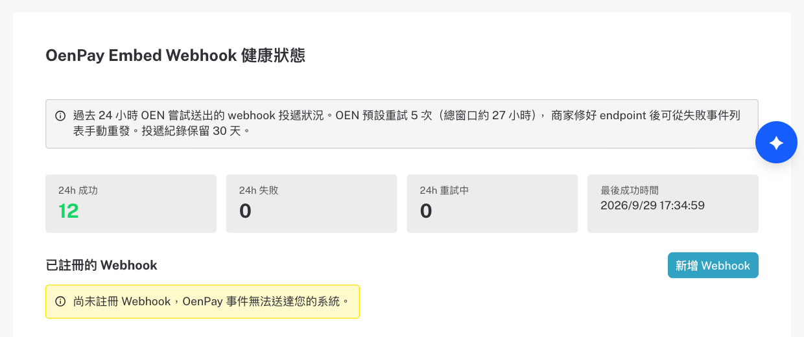
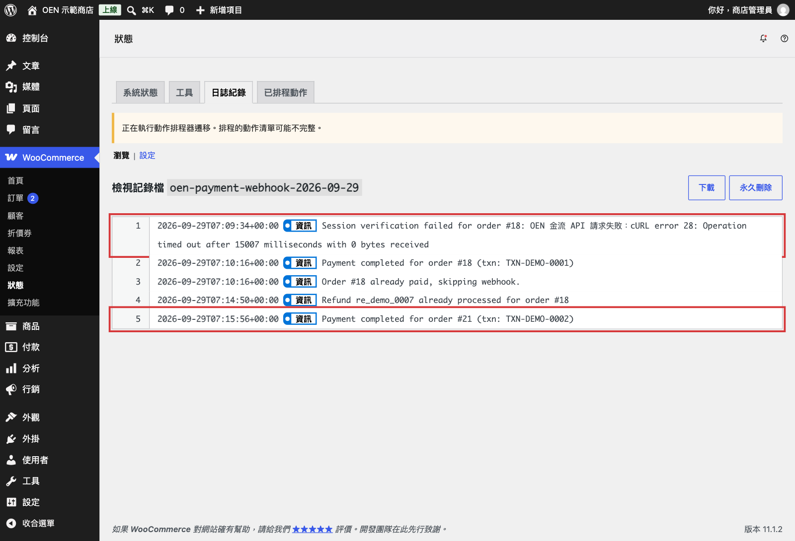
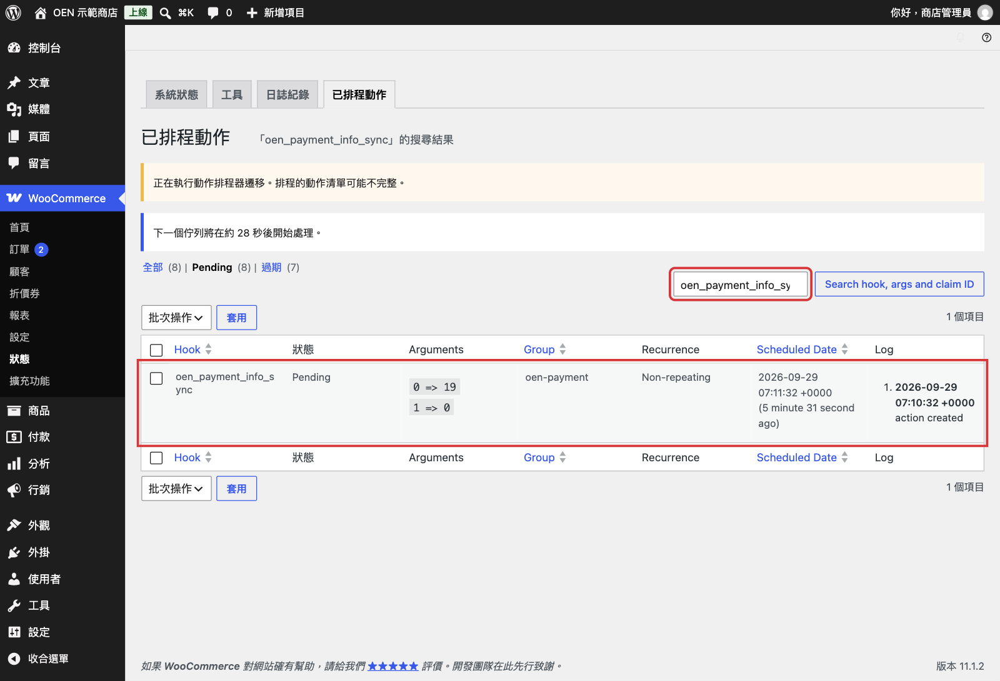
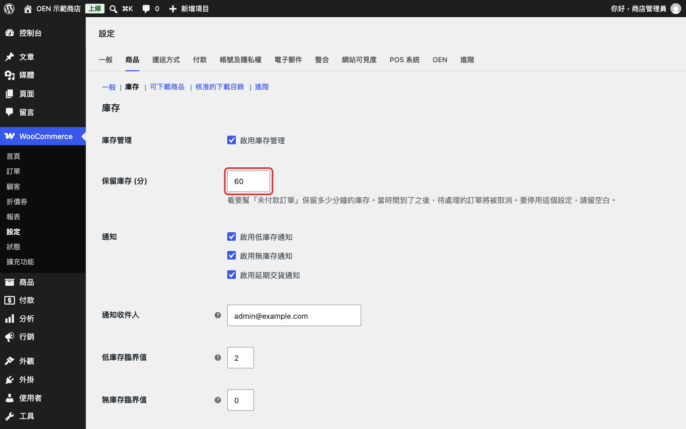

# 應援金流 WooCommerce 外掛常見問題

- 外掛介紹與串接技術說明：[README](../README.md)
- 安裝與設定步驟：[setup-guide.md](setup-guide.md)

## 目錄

**安裝與連線**

- [設定頁找不到 OEN 分頁](#設定頁找不到-oen-分頁)
- [需要到應援後台設定 Webhook 嗎？](#需要到應援後台設定-webhook-嗎)
- [應援後台顯示「尚未註冊 Webhook」](#應援後台顯示尚未註冊-webhook)
- [儲存設定時出現 OEN webhook auto-registration failed](#儲存設定時出現-oen-webhook-auto-registration-failed)
- [切換正式環境或更改網址後，收不到應援的付款通知](#切換正式環境或更改網址後收不到應援的付款通知)
- [Secret Key 外洩或需要更換怎麼辦？](#secret-key-外洩或需要更換怎麼辦)

**結帳與付款**

- [結帳頁沒有應援付款方式](#結帳頁沒有應援付款方式)
- [應援付款完成後，訂單一直停在「等待付款中」或「保留」](#應援付款完成後訂單一直停在等待付款中或保留)
- [外掛支援哪些幣別？金額有小數怎麼辦？](#外掛支援哪些幣別金額有小數怎麼辦)

**超商繳費**

- [超商繳費代碼沒有顯示](#超商繳費代碼沒有顯示)
- [為什麼超商繳費訂單是「保留」？會被自動取消嗎？](#為什麼超商繳費訂單是保留會被自動取消嗎)

**退款與發票**

- [退款要按哪個按鈕？超商繳費訂單可以退款嗎？](#退款要按哪個按鈕超商繳費訂單可以退款嗎)
- [在應援後台退款，WooCommerce 會同步嗎？](#在應援後台退款woocommerce-會同步嗎)
- [外掛會處理發票嗎？](#外掛會處理發票嗎)

**其他**

- [可以使用應援的定期定額或綁定信用卡嗎？](#可以使用應援的定期定額或綁定信用卡嗎)
- [回報問題時需要提供哪些資料？](#回報問題時需要提供哪些資料)

## 安裝與連線

### 設定頁找不到 OEN 分頁

**原因一**：WooCommerce 沒有啟用。外掛在 WooCommerce 未啟用時只會顯示後台提示，不會載入設定頁。

**原因二**：外掛版本低於 1.0.2。1.0.0、1.0.1 有設定分頁不會出現的缺陷，已在 1.0.2 修正，請更新到最新版。

**處理方式**：先啟用 WooCommerce，再到 **WooCommerce › 設定 › OEN**。外掛列表的 OEN 外掛沒有「設定」連結，請從這個路徑進入。

### 需要到應援後台設定 Webhook 嗎？

不需要。在 **WooCommerce › 設定 › OEN** 填好商店代碼與 Secret Key 並儲存後，外掛會自動向應援註冊付款通知網址 `https://你的網站/?wc-api=oen_payment`，並把簽章密鑰存進「Webhook Secret」。成功時畫面會出現「OEN webhook registered (…)」。

- Webhook 登記在儲存當下「OEN 測試環境」所選的環境。
- 通知網址由 WordPress 的網站網址（**設定 › 一般**）組成，網站網址必須是應援能從公網連線的網址。

第一次儲存或勾選「Re-register webhook」儲存時，如果應援上已經有同一個網址的 Webhook（例如先前手動建立的），外掛會沿用它、更新訂閱事件並換新簽章密鑰，不會重複建立，畫面顯示「OEN webhook updated (…)」。

### 應援後台顯示「尚未註冊 Webhook」

不影響付款通知。外掛透過應援 API 註冊的 Webhook，不會列在應援後台 **總設定 › OenPay Embed › OenPay Embed Webhook 健康狀態** 的「已註冊的 Webhook」，所以那裡會顯示「尚未註冊 Webhook，OenPay 事件無法送達您的系統。」。

- 請以外掛設定頁的「OEN webhook registered (…)」訊息，以及訂單是否自動改為「處理中」為準。
- 不需要在應援後台按「新增 Webhook」。
- 同一張卡片的「24h 成功」會計入外掛收到的通知；「投遞失敗事件」也會列出送達失敗的付款與退款通知，並提供「重發」按鈕。
- 外掛的 Webhook 無法在應援後台停用或刪除，如需處理請洽應援。

### 儲存設定時出現 OEN webhook auto-registration failed

**原因**：設定已經儲存，但外掛沒有成功在應援註冊 Webhook。可能是 Secret Key 與「OEN 測試環境」的勾選狀態屬於不同環境（例如勾選測試環境，卻填了正式環境的 Secret Key），或網站無法對外連線到應援。錯誤訊息冒號後面會附上應援回傳的原因。

**處理方式**：

1. 確認「OEN 測試環境」的勾選狀態，和商店代碼、Secret Key 屬於同一個應援環境。
2. 勾選「Re-register webhook」，再按「儲存設定」。
3. 成功時會出現「OEN webhook registered (…)」或「OEN webhook updated (…)」。

問題仍然存在時，請聯絡[應援說明中心](https://oen.tw/support)確認憑證與帳號狀態。

### 切換正式環境或更改網址後，收不到應援的付款通知

**原因**：一般儲存不會重新註冊 Webhook，應援仍把通知送到原本的環境或舊網址。

**處理方式**：勾選「Re-register webhook」後按「儲存設定」。切換環境時，商店代碼與 Secret Key 要換成該環境的憑證。變更網址時，外掛會為新網址另外建立一筆 Webhook；舊網址的 Webhook 不會被外掛刪除，如需移除請洽應援。

步驟請見[設定教學步驟 7](setup-guide.md#步驟-7切換到應援正式環境)。

### Secret Key 外洩或需要更換怎麼辦？

1. 到應援後台 **總設定 › OenPay Embed › Embed API Key**（步驟同[設定教學步驟 1](setup-guide.md#產生-secret-key)）。**金鑰外洩時**，先按「撤銷」停用這個網域的金鑰，再按「產生金鑰」；只是例行更換時，按「重新產生金鑰」。撤銷後到填入新金鑰之前，外掛無法連線到應援。需要協助時請聯絡應援（[說明中心](https://oen.tw/support)或 [info@oen.tw](mailto:info@oen.tw)）。
2. 到 **WooCommerce › 設定 › OEN** 填入新的 Secret Key，同時勾選「Re-register webhook」後儲存。外掛會替同一網址的 Webhook 換新簽章密鑰，並自動存入「Webhook Secret」。

## 結帳與付款

### 結帳頁沒有應援付款方式

依序檢查：

1. **WooCommerce › 設定 › OEN** 的「啟用 OEN 金流付款方式」已勾選並儲存。
2. 「商店代碼」與「Secret Key」都已填寫。任一欄為空時，應援付款方式不會顯示。
3. **WooCommerce › 設定 › 付款** 中，「OEN 信用卡」「OEN 超商繳費」的狀態為「啟用」。

步驟請見[設定教學步驟 4、5](setup-guide.md#步驟-4連接應援測試環境)。

### 應援付款完成後，訂單一直停在「等待付款中」或「保留」

訂單狀態由應援的付款通知（Webhook）更新，外掛收到通知後，會先向應援查詢確認才變更訂單。請到 **WooCommerce › 狀態 › 日誌紀錄**，開啟 `oen-payment-webhook` 開頭的日誌檔。

依日誌內容判斷：

| 日誌訊息 | 代表意思 | 處理方式 |
|---|---|---|
| 完全沒有紀錄 | 應援的通知沒有送到網站 | 確認 WordPress 的網站網址（**設定 › 一般**）是公網可連線的網址；防火牆、CDN 或安全性外掛沒有擋下 `/?wc-api=oen_payment`；Webhook 是在目前使用的應援環境註冊的 |
| `Payment completed for order #…` | 已向應援確認付款並更新訂單 | 無須處理 |
| `Invalid webhook signature`、`Missing OenPay-Signature header` | 應援通知的簽章驗證失敗 | 勾選「Re-register webhook」後儲存，重新同步簽章密鑰 |
| `Expired webhook signature timestamp` | 伺服器時間和實際時間相差超過 300 秒 | 校正伺服器系統時間 |
| `Session verification failed for order #…` | 外掛向應援查詢付款結果時連線失敗或逾時 | 確認網站能對外連線到應援。外掛不會變更訂單，並等待應援重送通知 |
| `Order ID mismatch during …`、`Amount mismatch during …` | 應援查到的訂單編號或金額，與 WooCommerce 訂單不一致 | 檢查訂單建立後是否被改過金額；或這組應援憑證是否同時被其他網站（例如測試站）使用，通知屬於那個網站的訂單 |
| `Order not found for OEN orderId: …` | 找不到對應的 WooCommerce 訂單 | 訂單可能已被刪除；或這組應援憑證同時被其他網站（例如測試站）使用，通知屬於那個網站的訂單 |
| `Ignoring stale webhook for order #…` | 這是同一張訂單較早的付款嘗試（例如消費者改選了另一種應援付款方式） | 正常現象，無須處理 |
| `Ignoring webhook for order #…: type=…, verified_status=…` | 通知內容和應援查到的狀態不一致，外掛不變更訂單 | 等待後續通知，或到應援的交易紀錄確認狀態 |

### 外掛支援哪些幣別？金額有小數怎麼辦？

應援金流本身支援多幣別收款，但這個外掛目前固定以**新台幣整數金額**向應援請款，不會換算其他幣別。

請到 **WooCommerce › 設定 › 一般**，將「貨幣」設為新台幣（TWD）、「小數位數」設為 0。小數位數不為 0 時，送給應援的金額與商品明細可能不一致。步驟請見[設定教學步驟 3](setup-guide.md#步驟-3確認商店幣別)。

## 超商繳費

### 超商繳費代碼沒有顯示

**原因一：消費者剛下單。** 繳費代碼是消費者在應援付款頁選擇超商繳費後才產生的，外掛透過 WordPress 排程向應援查詢（訂單進入「保留」後約 1、4、14、44 分鐘，共 4 次）。消費者在應援完成頁按「返回網站」時，第一次查詢通常還沒執行，所以「已收到訂單」頁還沒有代碼；稍後重新整理即可。應援完成頁本身有顯示代碼。

**原因二：排程沒有執行。** WP-Cron 沒有運作時，查詢就不會執行。

到 **WooCommerce › 狀態 › 已排程動作**，搜尋 `oen_payment_info_sync`。若項目停在 `Pending`，而排定時間已經過了，就代表排程沒有在跑。

**處理方式**：

- 確認網站可以連線到自己的網址（WP-Cron 需要）。流量低的網站可改用主機的系統排程，定期呼叫 `wp-cron.php`。
- 急需時，可在該項目上按 `Run` 立即執行一次。

**原因三：消費者沒有在應援付款頁選擇超商繳費。** 這種情況下應援不會產生代碼，外掛查詢 4 次後就停止。

### 為什麼超商繳費訂單是「保留」？會被自動取消嗎？

超商繳費需要消費者另外到超商付款，所以外掛建立應援付款後、導向應援付款頁之前，就把超商繳費訂單設為「保留」，等待應援的付款通知。

WooCommerce 的「保留庫存 (分)」只會自動取消「等待付款中」的訂單，因此超商繳費訂單不會因為這個設定被取消。

設定位置：**WooCommerce › 設定 › 商品 › 庫存**

- 應援送出付款失敗、逾期或取消的通知時，外掛會把訂單改為「失敗」；沒有收到這類通知時，訂單會維持「保留」，請依繳費期限自行處理。
- 已取得繳費代碼的訂單，超過應援付款頁的付款時限後仍維持「保留」，不會被改為「失敗」，消費者可在繳費期限內繳費。
- OEN 信用卡訂單在導向應援付款頁時是「等待付款中」。消費者沒有完成付款時，WooCommerce 會依「保留庫存 (分)」自動取消符合條件的訂單，詳見 WooCommerce 的[訂單狀態說明](https://woocommerce.com/document/managing-orders/order-statuses/)。

## 退款與發票

### 退款要按哪個按鈕？超商繳費訂單可以退款嗎？

- 信用卡訂單請按 **「透過 OEN 信用卡 退款」**。外掛會通知應援退款，應援確認後才會在 WooCommerce 記錄退款。
- **不要按「手動退款」**：它只在 WooCommerce 記錄退款，不會通知應援把款項退給消費者。
- 超商繳費訂單不支援透過應援退款，訂單頁不會出現應援退款按鈕。

步驟請見[設定教學步驟 6](setup-guide.md#試退款)。

### 在應援後台退款，WooCommerce 會同步嗎？

不會。在應援後台「金流管理」的交易明細按「退款」，款項會退給消費者，但 WooCommerce 訂單的狀態與金額都不會改變。

**處理方式**：

1. 在 WooCommerce 訂單按「退費」，輸入和應援後台相同的金額。
2. 按「**手動退款**」，只在 WooCommerce 補記錄。
3. 不要再按「透過 OEN 信用卡 退款」：應援可能回應錯誤，也可能再退一次款給消費者。

建議所有退款都從 WooCommerce 發起，兩邊的紀錄才會一致。

### 外掛會處理發票嗎？

外掛不傳送、也不儲存任何發票資料。應援提供發票代開服務（見[應援金流](https://oen.tw/product/payments)介紹頁）；透過本外掛成立的交易如何開立發票、發票的設定與查詢，請聯絡應援確認。

## 其他

### 可以使用應援的定期定額或綁定信用卡嗎？

目前不行。應援金流提供定期定額、綁定信用卡等服務，但這個外掛目前只支援一次性付款。

### 回報問題時需要提供哪些資料？

- 應援帳號、交易、帳務問題：聯絡[應援說明中心](https://oen.tw/support)或 [info@oen.tw](mailto:info@oen.tw)。
- 外掛問題：到 [GitHub Issues](https://github.com/OEN-Tech/woocommerce-oen-payment/issues) 回報，並附上：
  - WordPress、WooCommerce、PHP 與外掛版本（可在「外掛」列表與 **WooCommerce › 狀態 › 系統狀態** 查看）。
  - 問題畫面截圖與訂單備註。
  - **WooCommerce › 狀態 › 日誌紀錄** 中 `oen-payment`、`oen-payment-webhook`、`oen-payment-info` 開頭的日誌。

> **注意**：提供前請確認截圖與日誌中沒有 Secret Key、Webhook Secret 等密鑰，並遮蔽消費者的個人資料。
