# 應援金流 WooCommerce 外掛設定教學

本文件帶你從申請應援商店開始，一路完成取得憑證、安裝、連接應援、試收款，到正式上線。

截圖取自實際操作（2026-09-29），包含應援後台、應援付款頁與 WooCommerce 後台。畫面中的網域名稱、交易編號、繳費代碼、Webhook ID 與買家資料都已換成示範值或遮蔽，金鑰欄位也已遮蔽。應援後台的畫面可能與你看到的略有不同。

- 外掛介紹與串接技術說明：[README](../README.md)
- 常見問題：[faq.md](faq.md)

## 目錄

- [流程總覽](#流程總覽)
- [步驟 1：申請應援商店並取得憑證](#步驟-1申請應援商店並取得憑證)
- [步驟 2：安裝外掛](#步驟-2安裝外掛)
- [步驟 3：確認商店幣別](#步驟-3確認商店幣別)
- [步驟 4：連接應援測試環境](#步驟-4連接應援測試環境)
- [步驟 5：開啟應援付款方式](#步驟-5開啟應援付款方式)
- [步驟 6：在應援測試環境試收款](#步驟-6在應援測試環境試收款)
- [步驟 7：切換到應援正式環境](#步驟-7切換到應援正式環境)
- [上線確認清單](#上線確認清單)
- [需要協助](#需要協助)

## 流程總覽

| 步驟 | 在哪裡操作 | 要做的事 |
|---|---|---|
| 1 | 應援後台 | 查看網域名稱（即商店代碼），產生 Secret Key |
| 2 | WordPress 後台 › 外掛 | 上傳並啟用外掛 |
| 3 | WooCommerce › 設定 › 一般 | 確認幣別為新台幣、小數位數為 0 |
| 4 | WooCommerce › 設定 › OEN | 填入商店代碼與 Secret Key，外掛自動向應援註冊 Webhook |
| 5 | WooCommerce › 設定 › 付款 | 開啟「OEN 信用卡」「OEN 超商繳費」 |
| 6 | 商店前台、WooCommerce 後台、應援後台 | 下單付款、查看訂單、試退款，並與應援的交易紀錄對照 |
| 7 | WooCommerce › 設定 › OEN | 換成應援正式環境憑證，重新註冊 Webhook |

本文件的截圖環境：WordPress 7.1.2、WooCommerce 11.1.2、PHP 8.2、MariaDB 11.4，外掛 1.0.4。

## 步驟 1：申請應援商店並取得憑證

### 申請應援商店

到[應援科技官網](https://oen.tw/contact)預約諮詢，申請應援商店。公司或個人皆可申請（個人需身分證與銀行帳戶，經審核通過）。

外掛需要兩項憑證：**商店代碼**與 **Secret Key**。兩者都在應援後台取得。外掛依「OEN 測試環境」的勾選狀態連線不同的應援 API 主機，憑證要和所選的環境對應：

| 環境 | 應援 API 主機 | 用途 |
|---|---|---|
| 測試環境 | `api.testing.oen.tw` | 上線前試收款、試退款 |
| 正式環境 | `api.oen.tw` | 正式收款 |

> **提示**：使用測試環境前，請先向應援確認你的測試環境已開通 Hosted Checkout（應援付款頁），並取得測試環境的後台登入方式與測試卡資料。

### 查看商店代碼

1. 登入應援後台，在左側選單按「總設定」。
2. 在「總設定」分頁最下方的「Oen 服務資訊」，找到「網域名稱」。
3. 「網域名稱」就是外掛的「商店代碼」。

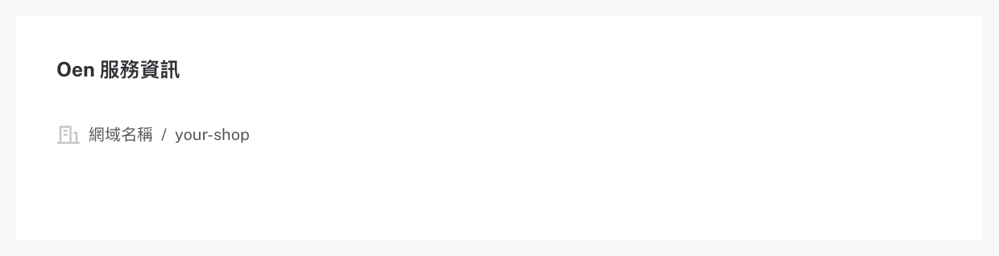

### 產生 Secret Key

1. 在「總設定」選擇「OenPay Embed」分頁。
2. 在「Embed API Key」區塊按「產生金鑰」。

   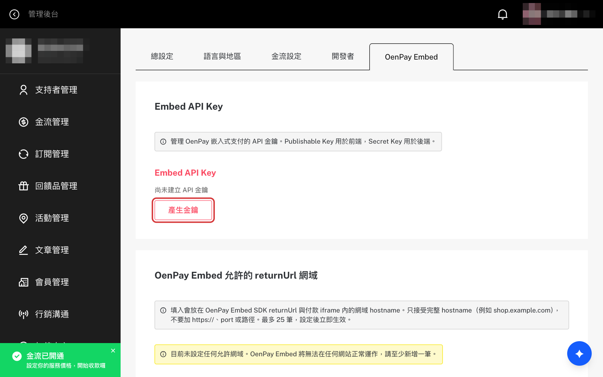

3. 對話框會提醒這是高風險操作。輸入你的網域名稱確認，再按「產生金鑰」。對話框中的「Live 模式」是應援後台的固定文字；金鑰屬於你目前登入的應援環境（測試或正式）。

   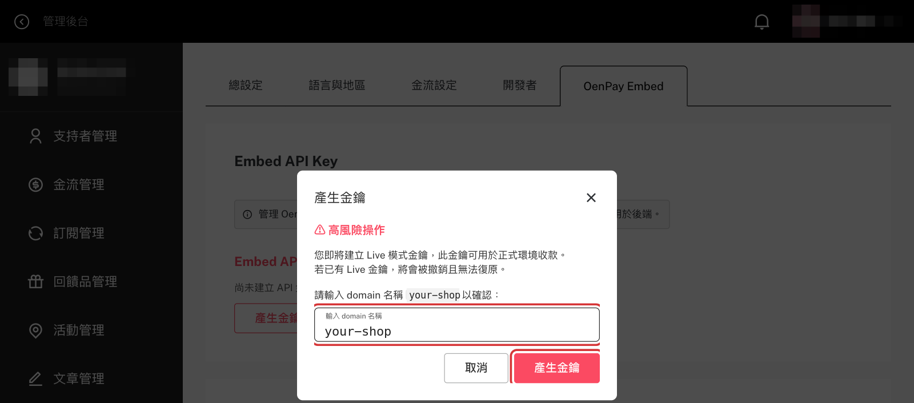

4. 畫面顯示 Publishable Key 與 Secret Key。**Secret Key 只會顯示這一次**，頁面也會在倒數結束（約 5 分鐘）後自動清除。按 Secret Key 右側的「複製」，直接貼到外掛設定頁（[步驟 4](#步驟-4連接應援測試環境)），或存到安全的地方。
5. 勾選「我已妥善保存 Secret Key」，按「立即清除」。

   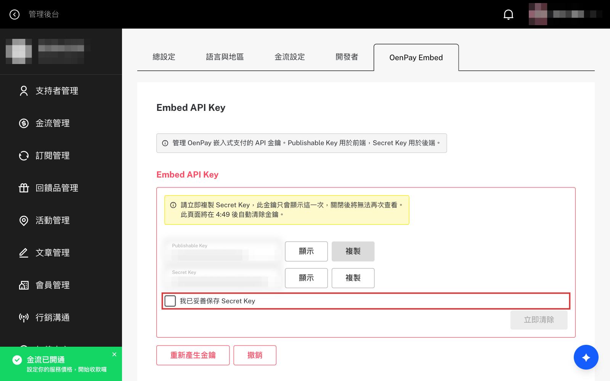

> **注意**
> - 外掛只需要 Secret Key，不需要 Publishable Key。
> - 「開發者」分頁的「存取 Token」不是外掛要用的金鑰。
> - 找不到「OenPay Embed」分頁時，代表應援還沒替你的商店開通，或登入的帳號沒有查看 API 串接的權限；請先確認帳號權限，再聯絡應援。按鈕無法使用時，請確認登入的帳號有管理 API 串接的權限。
> - 例行更換金鑰時，按「重新產生金鑰」，並立即把新的 Secret Key 填回外掛設定頁。**Secret Key 外洩時**，先按「撤銷」停用這個網域的金鑰，再按「產生金鑰」並填回外掛；撤銷後到填入新金鑰之前，外掛無法連線到應援。
> - Secret Key 等同密碼。請勿傳給他人、貼到公開的地方，或出現在截圖中。

## 步驟 2：安裝外掛

### 下載外掛

1. 前往 [GitHub Releases](https://github.com/OEN-Tech/woocommerce-oen-payment/releases)，下載最新版的「Source code (zip)」。
2. 解壓縮後，將資料夾（例如 `woocommerce-oen-payment-1.0.4`）改名為 **`woocommerce-oen-payment`**。
3. 將改名後的資料夾重新壓縮成 `woocommerce-oen-payment.zip`。

資料夾名稱要固定為 `woocommerce-oen-payment`，日後上傳新版時 WordPress 才會更新原本的外掛，而不是另外裝一份。

### 上傳並啟用

1. 到 **外掛 › 安裝外掛**，按「上傳外掛」，選擇 `woocommerce-oen-payment.zip`，按「立即安裝」。

   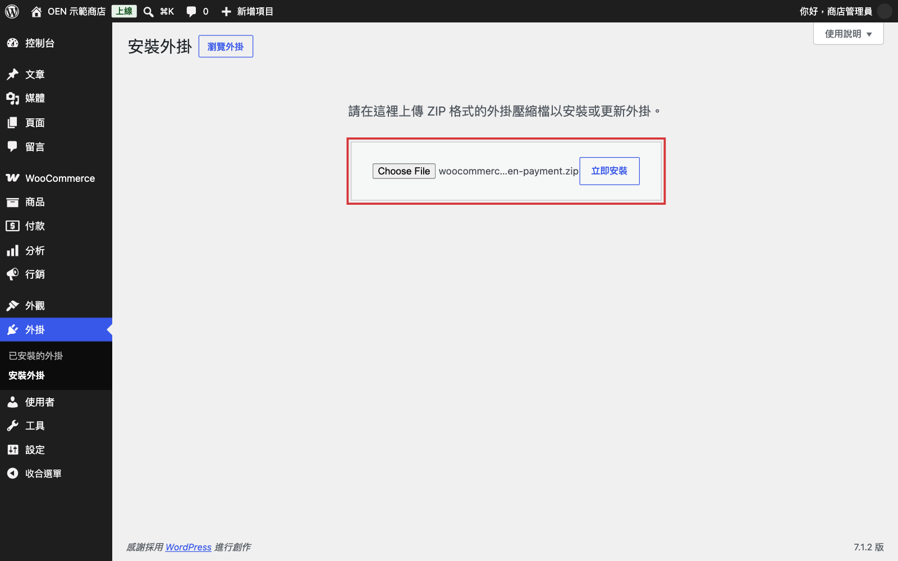

2. 安裝完成後按「啟用外掛」。

   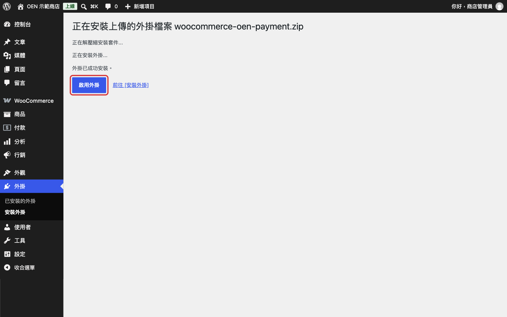

3. 外掛列表出現「WooCommerce OEN Payment Gateway」，代表安裝完成。

   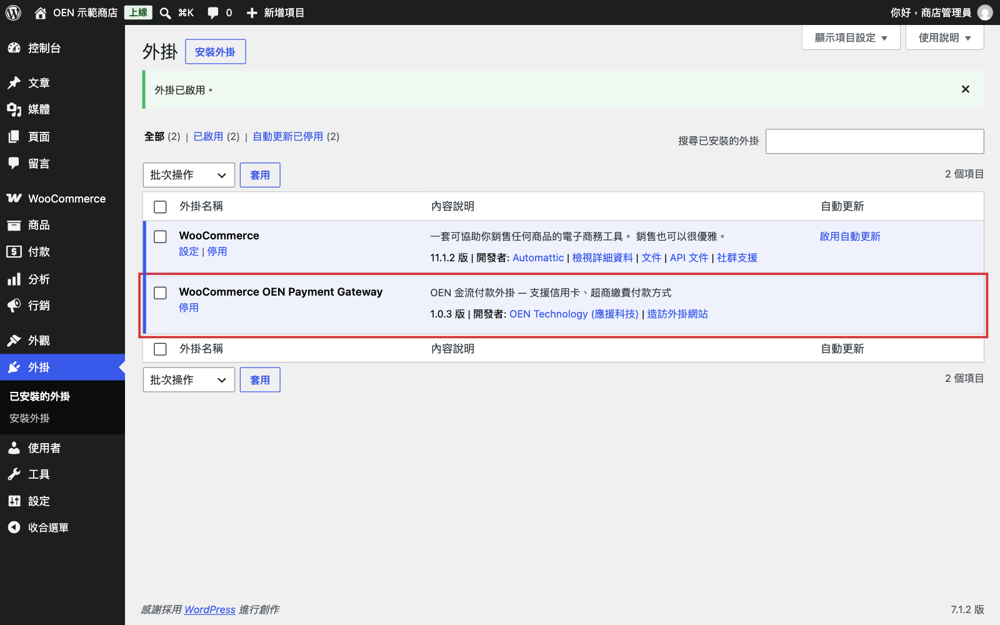

> **注意**
> - 外掛需要 WooCommerce。WooCommerce 未啟用時，外掛只會在後台顯示提示，不會載入任何功能。
> - 外掛列表中沒有「設定」連結，應援的設定頁位於 **WooCommerce › 設定 › OEN**。

## 步驟 3：確認商店幣別

應援金流以**新台幣整數金額**收款，外掛不會換算其他幣別，也會捨去訂單總額的小數部分。

到 **WooCommerce › 設定 › 一般 › 貨幣選項**，確認：

- 貨幣：新台幣 (NT$) — TWD
- 小數位數：0

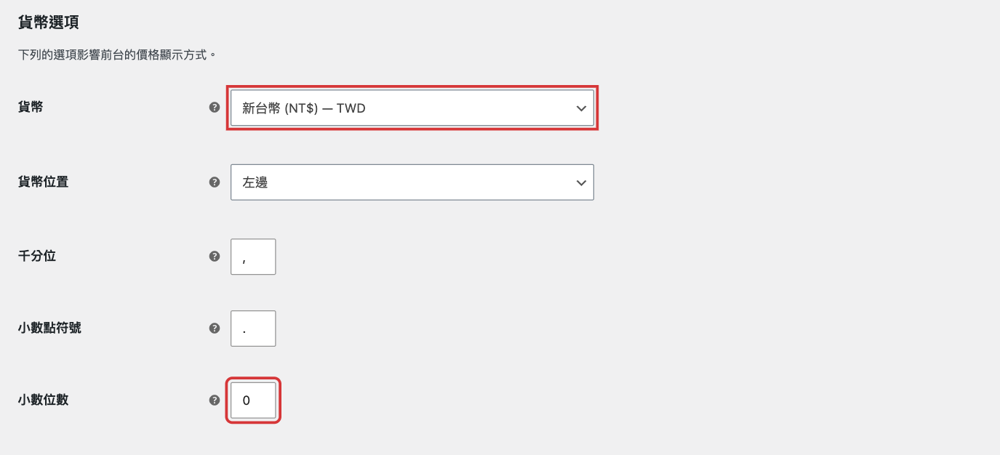

## 步驟 4：連接應援測試環境

### 開啟應援設定頁

到 **WooCommerce › 設定**，點選 **OEN** 分頁。

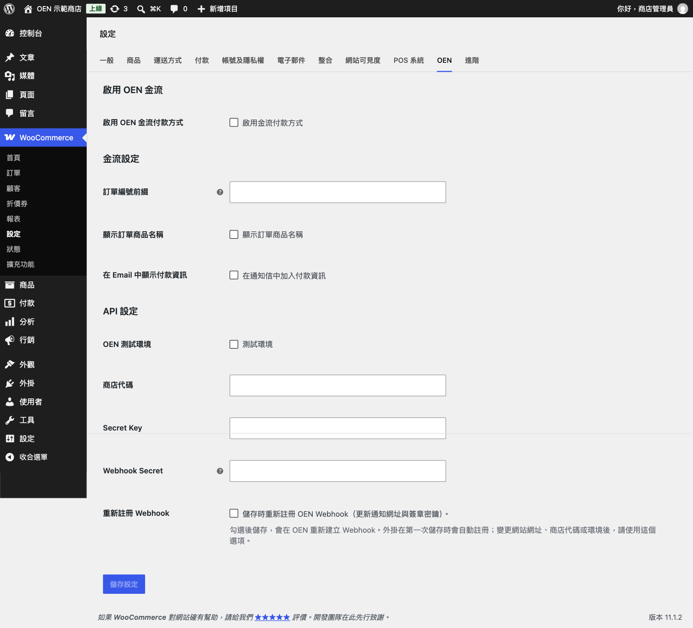

### 填入應援測試環境憑證

1. 勾選「啟用 OEN 金流付款方式」。
2. 勾選「OEN 測試環境」。
3. 「商店代碼」填入[步驟 1](#查看商店代碼) 的網域名稱，「Secret Key」填入[步驟 1](#產生-secret-key) 產生的 Secret Key。兩者都要是**測試環境**的值。
4. 「Webhook Secret」**留空**，儲存後外掛會自動填入。
5. 按「儲存設定」。

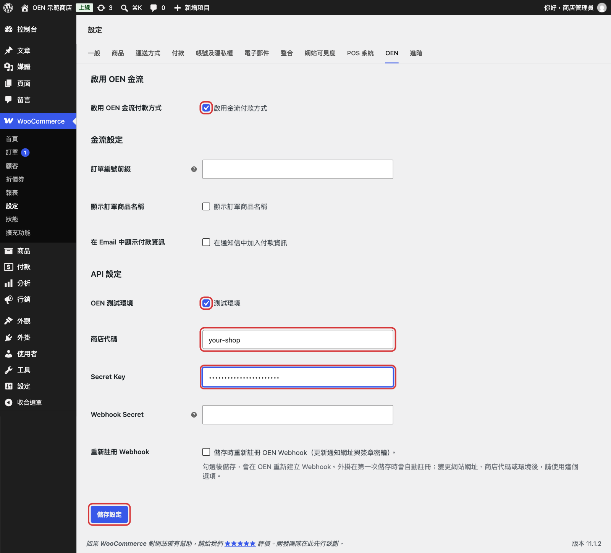

其他選填設定：

| 設定 | 說明 |
|---|---|
| 訂單編號前綴 | 加在 WooCommerce 訂單 ID 前面，組成送給應援的訂單編號。**有未付款訂單時請勿更改** |
| 顯示訂單商品名稱 | 勾選後把逐項商品明細送給應援；未勾選時只送一筆「{網站名稱} 訂單」 |
| 在 Email 中顯示付款資訊 | 在訂單通知信中加入應援交易編號、付款時間、超商繳費代碼 |

### 確認已連上應援

儲存後，外掛會自動向應援註冊付款通知網址（Webhook）並保存簽章密鑰，**不需要到應援後台手動設定**。成功時畫面上方會出現：

```text
OEN webhook registered (…). The signing secret was stored automatically.
```

如果應援上已經有同一個網址的 Webhook（例如以前手動建立的），外掛會沿用它、更新訂閱事件並換新簽章密鑰，這時顯示的是：

```text
OEN webhook updated (…) and its signing secret refreshed.
```

同時「Webhook Secret」欄位會自動填入（顯示為遮罩）。

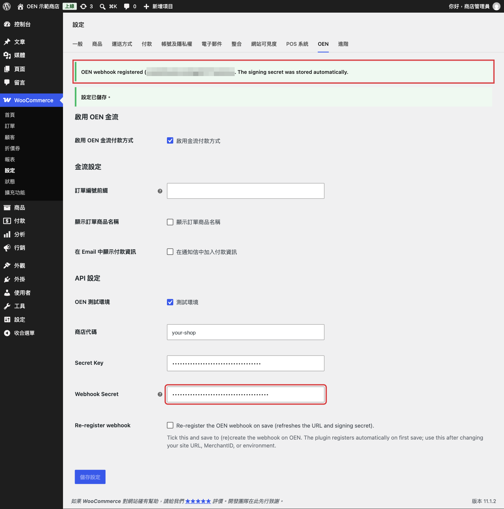

外掛向應援註冊的內容：

| 項目 | 內容 |
|---|---|
| 通知網址 | `https://你的網站/?wc-api=oen_payment` |
| 訂閱事件 | 付款完成、付款失敗、付款逾期、付款取消，以及退款建立、退款成功 |
| 登記的環境 | 儲存當下「OEN 測試環境」所選的環境 |

通知網址由 WordPress 的網站網址（**設定 › 一般**）組成。網站網址若是內網位址或 `localhost`，應援就無法送達通知；正式上線前請確認網站網址是從公網可以連線的網址。

> **注意**
> - 若出現「OEN webhook auto-registration failed: …」，代表設定已儲存，但外掛沒有連上應援完成註冊，請參考 [FAQ](faq.md#儲存設定時出現-oen-webhook-auto-registration-failed)。
> - 外掛註冊的 Webhook 不會列在應援後台「OenPay Embed Webhook 健康狀態」的「已註冊的 Webhook」，那裡會顯示「尚未註冊 Webhook，OenPay 事件無法送達您的系統。」。這不影響外掛接收付款通知，也不需要在應援後台另外「新增 Webhook」。詳見 [FAQ](faq.md#應援後台顯示尚未註冊-webhook)。

## 步驟 5：開啟應援付款方式

1. 到 **WooCommerce › 設定 › 付款**，在「OEN 信用卡」與「OEN 超商繳費」右側按「啟用」。

   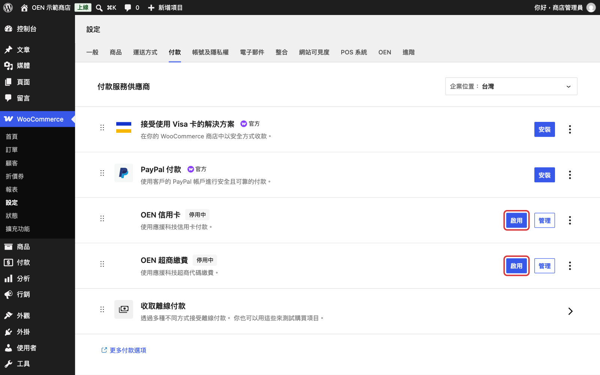

2. 狀態變成「啟用」即完成。

   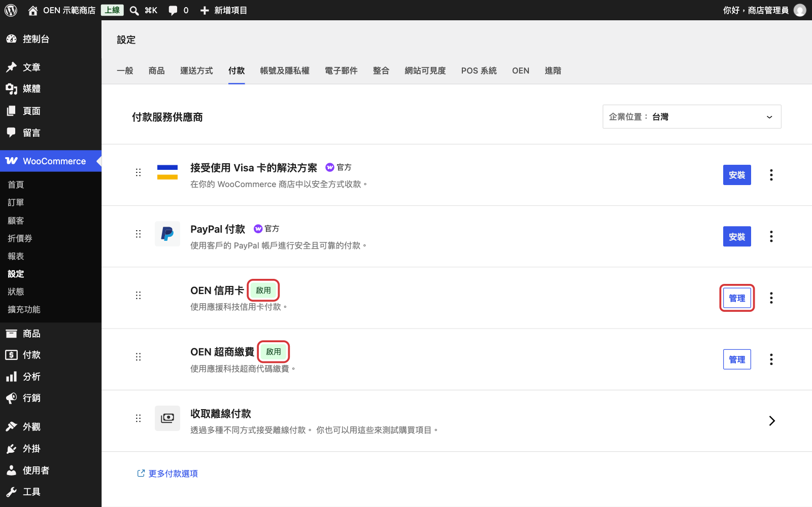

3. （選填）按「管理」可修改結帳頁顯示的「標題」與「說明」。

   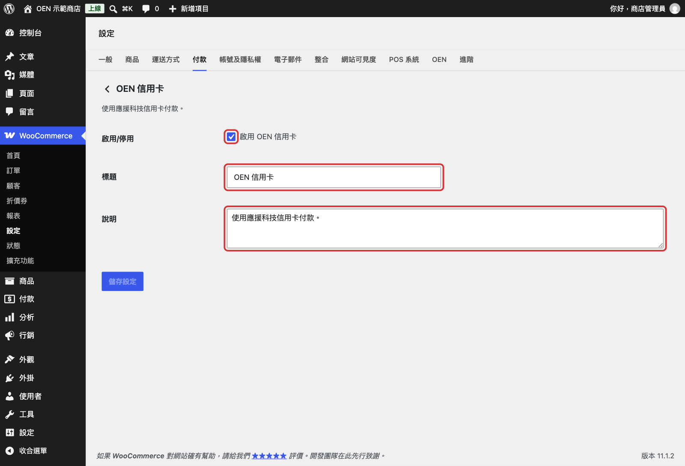

> **注意**：付款列表中找不到應援付款方式時，請確認[步驟 4](#步驟-4連接應援測試環境) 的「啟用 OEN 金流付款方式」已勾選並儲存。

## 步驟 6：在應援測試環境試收款

在應援測試環境下，信用卡與超商繳費各下一筆訂單，確認付款、訂單狀態與退款都正常。

### 以信用卡付款

1. 到商店前台將商品加入購物車，前往結帳頁，填寫聯絡資訊與帳單地址。
2. 在「付款選項」選擇「OEN 信用卡」，按「下單購買」。

   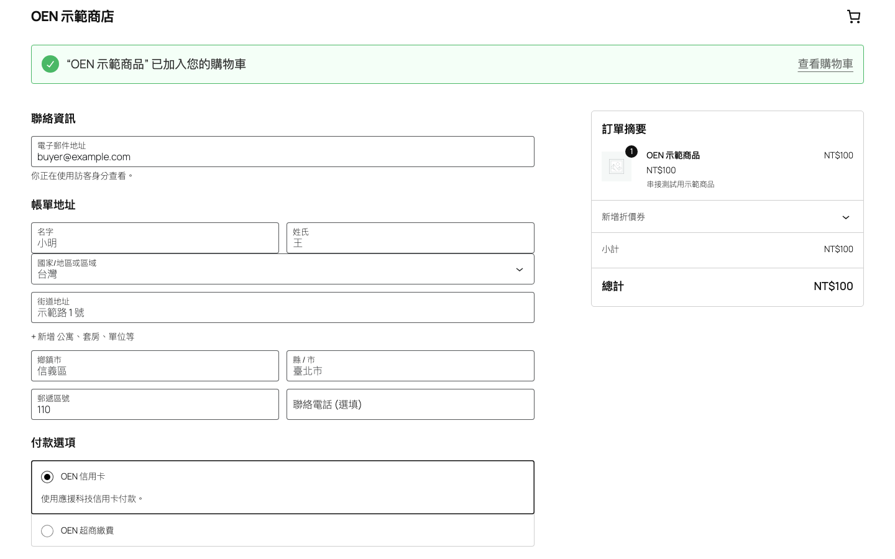

3. 頁面導向應援付款頁。左側是確認金額、付款時限倒數與商品內容，右側是信用卡欄位。

   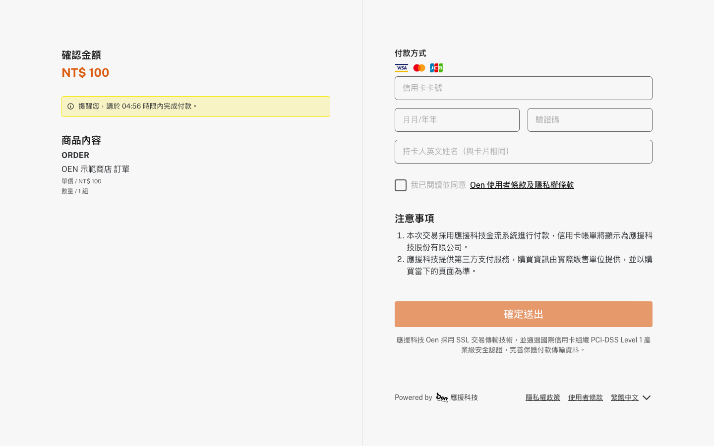

4. 填入卡號、有效期限、驗證碼與持卡人英文姓名。測試卡資料請依應援提供的說明。

   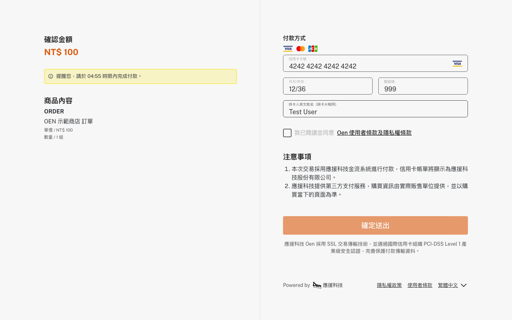

5. 勾選「我已閱讀並同意 Oen 使用者條款及隱私權條款」，按「確定送出」。
6. 付款完成後，應援導回商店的「已收到訂單」頁。

   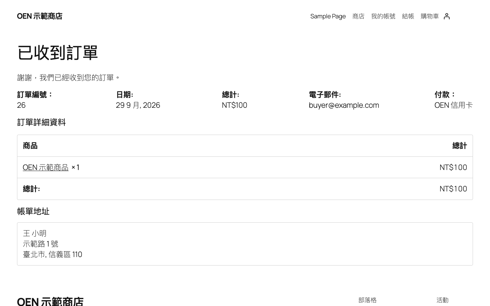

### 以超商繳費付款

1. 再下一筆訂單，這次選擇「OEN 超商繳費」，按「下單購買」。

   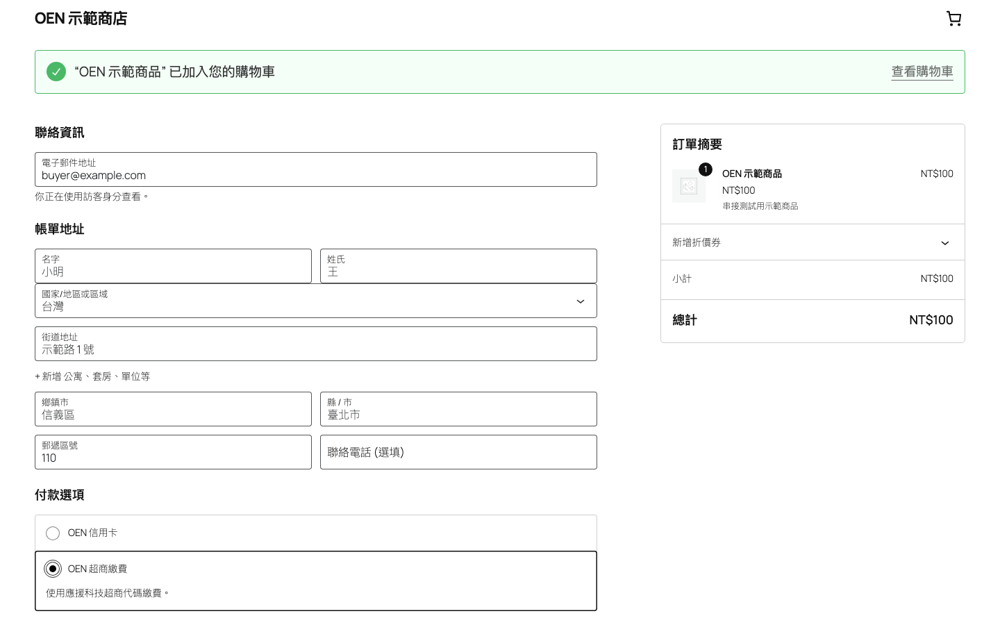

2. 應援付款頁顯示全家便利商店 FamiPort 的繳費步驟，並註明要在 48 小時內繳費。

   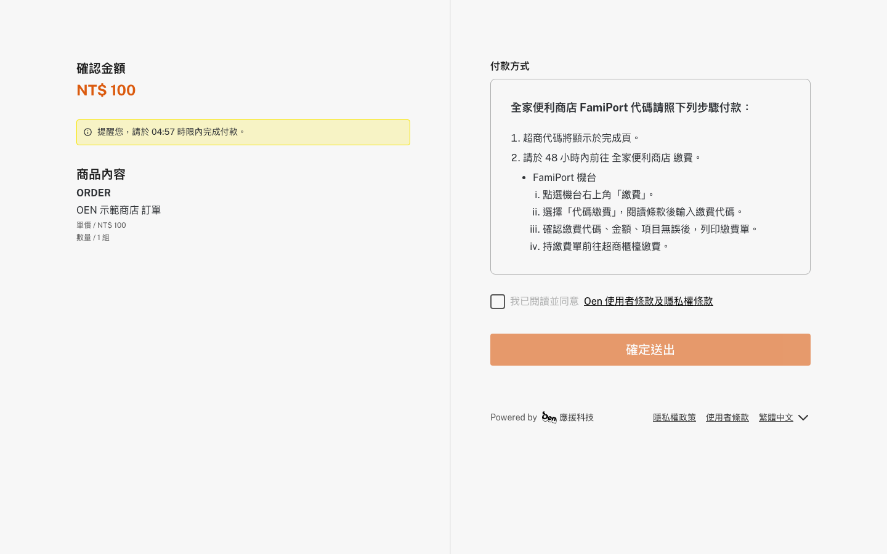

3. 勾選同意條款，按「確定送出」。
4. 完成頁顯示繳費期限、代收超商、超商代碼、付款金額與訂單編號，可按「列印此頁」。按「返回網站」回到商店。

   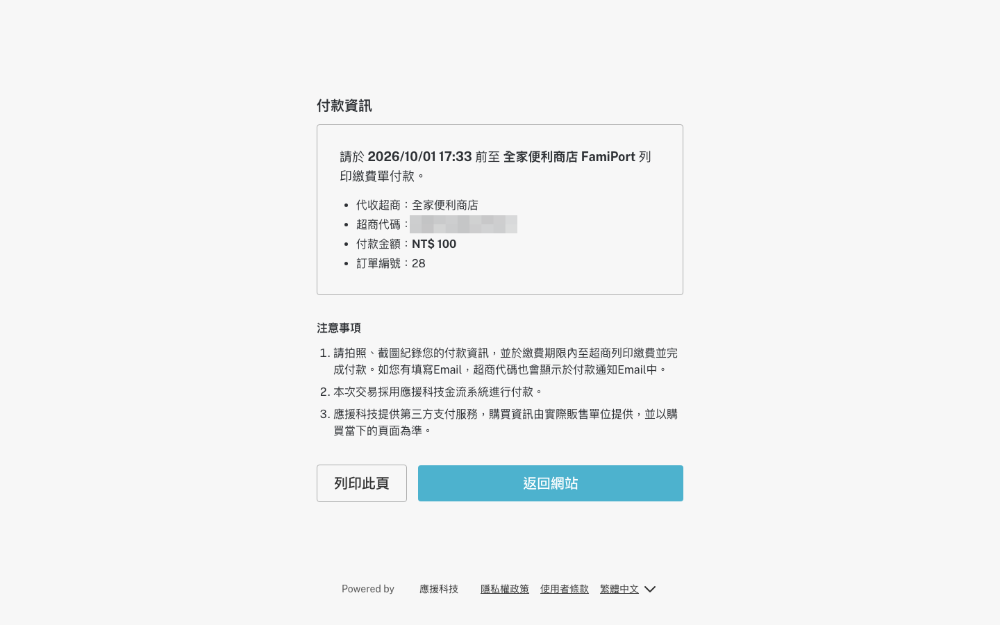

5. 回到「已收到訂單」頁時，頁面上通常**還沒有**繳費代碼。外掛要等約 1 分鐘後，才向應援查詢代碼並寫入訂單（見[查看訂單](#查看訂單)）。請提醒消費者在應援完成頁記下代碼。

   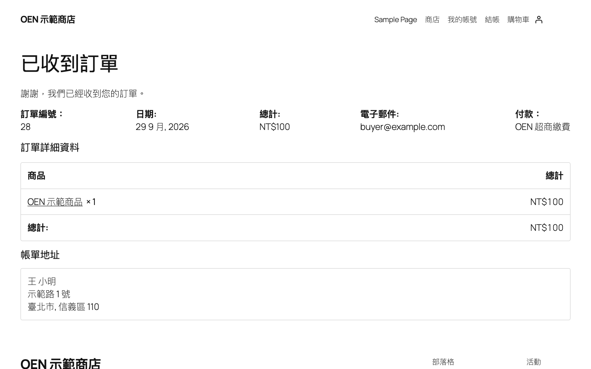

### 查看訂單

到 **WooCommerce › 訂單**。訂單狀態不是在消費者回到「已收到訂單」頁時更新的，而是外掛收到應援的付款通知、並向應援查詢確認（訂單編號、金額都要一致）之後才更新。

| 付款方式 | 導向應援付款頁後 | 應援確認付款後 |
|---|---|---|
| OEN 信用卡 | 等待付款中 | 處理中 |
| OEN 超商繳費 | 保留（等待消費者到超商繳費） | 處理中 |

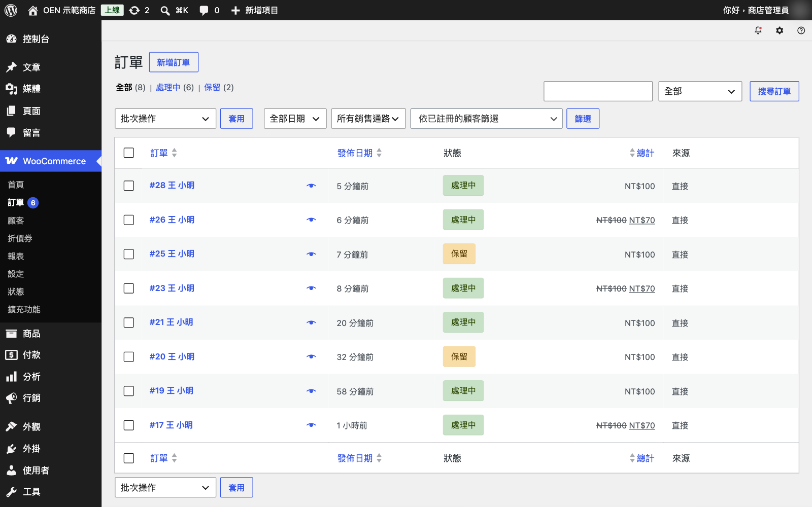

截圖中的訂單已經完成測試付款或退款，所以部分狀態和金額與剛下單時不同。

**信用卡訂單**

- 狀態為「處理中」。
- 訂單標題下方顯示應援交易編號與付款時間。
- 訂單備註出現「OEN Payment completed (verified). Transaction: …」，代表外掛已向應援確認付款。

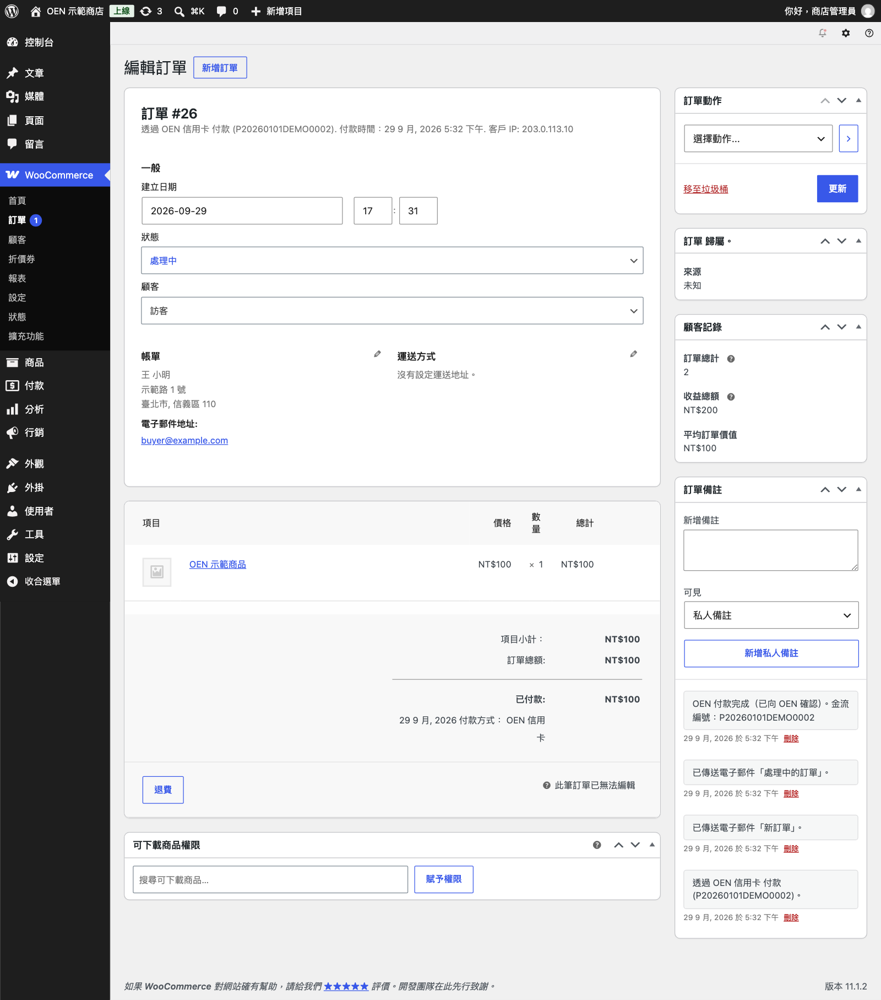

**超商繳費訂單**

- 訂單建立後為「保留」，等待消費者繳費。
- 外掛會在訂單進入保留後，約 1、4、14、44 分鐘各向應援查詢一次繳費代碼，共 4 次，取得後就停止。查詢由 WordPress 的排程（WP-Cron）執行，網站沒有人瀏覽時會延後。
- 取得代碼後，帳單地址下方顯示「OEN payment code」（繳費代碼、超商、繳費期限），訂單備註出現「OEN payment code received: …」。繳費期限依網站的時區與日期、時間格式（**設定 › 一般**）顯示。
- 已取得代碼的訂單，超過應援付款頁的付款時限後仍維持「保留」，消費者可以在繳費期限內繳費。
- 消費者繳費後，應援通知外掛，訂單改為「處理中」。

下面兩張截圖使用另一筆示範訂單，所以訂單編號和前面的截圖不同。

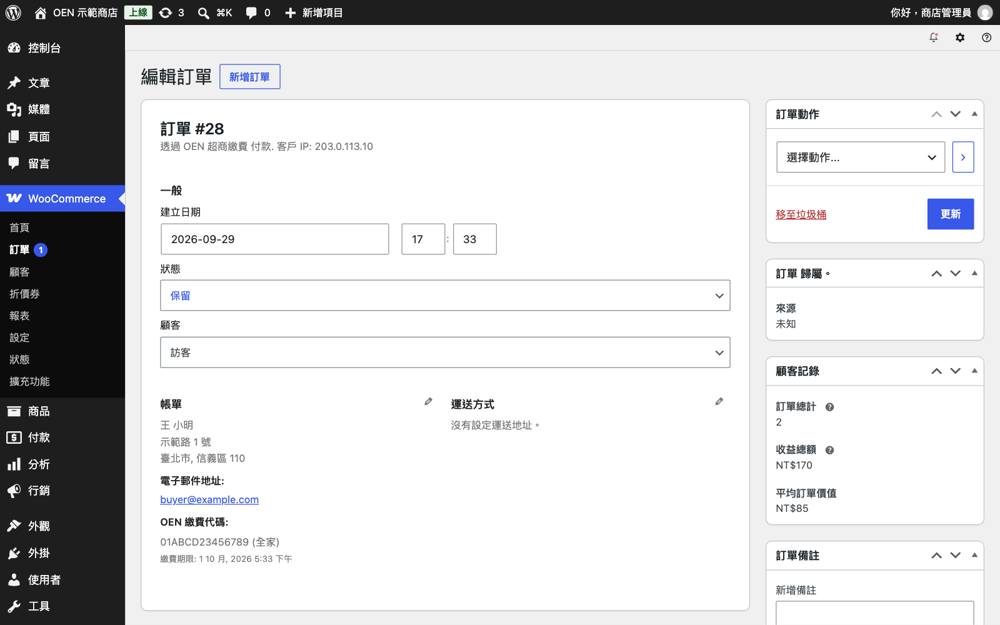

消費者可在「已收到訂單」頁與「我的帳號 › 訂單」看到繳費代碼。訪客之後再開啟「已收到訂單」頁時，WooCommerce 會先要求輸入下單的 Email。勾選「在 Email 中顯示付款資訊」時，訂單通知信也會附上代碼。

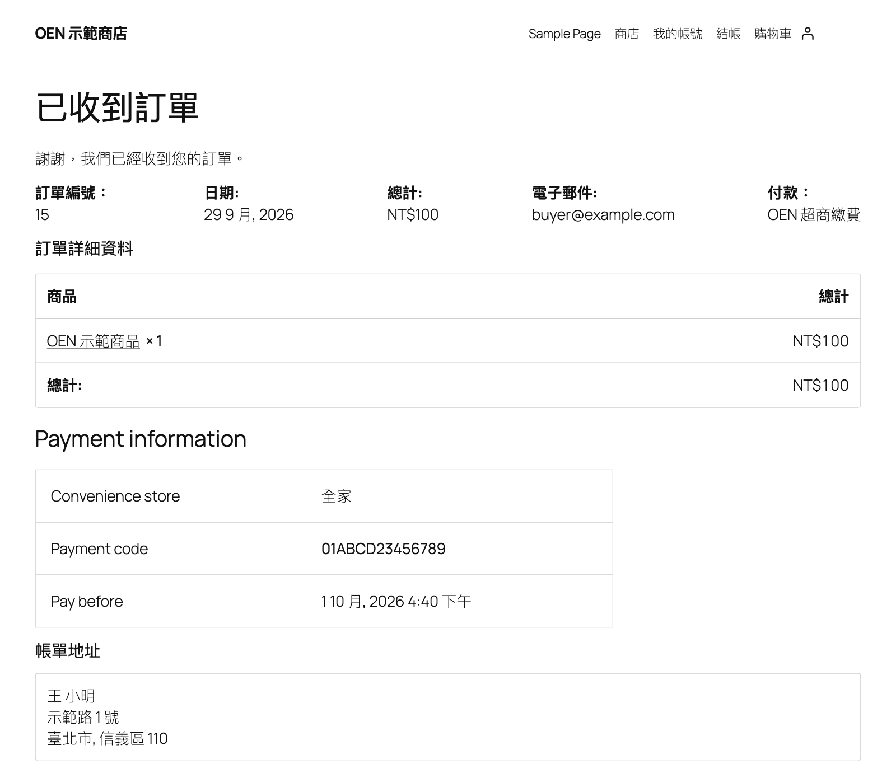

### 試退款

只有「OEN 信用卡」訂單可以透過應援退款，可全額或部分退款。

1. 進入信用卡訂單，按「退費」。
2. 輸入「退費金額」（整數元），可填寫退費理由。
3. 按 **「透過 OEN 信用卡 退款 NT$…」**。

   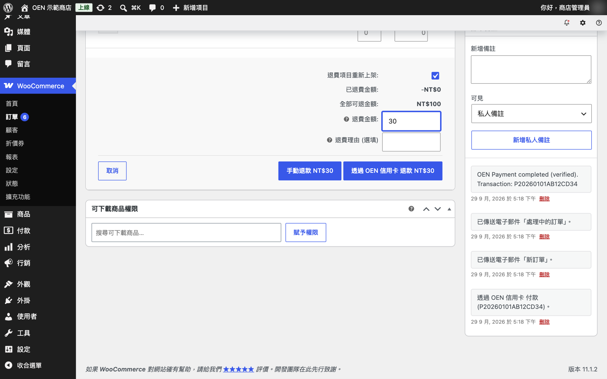

> **注意**：請不要按「手動退款」。手動退款只會在 WooCommerce 記錄退款，**不會**通知應援把款項退給消費者。

應援確認退款後，訂單會出現退款項目與「已退費」金額，訂單備註出現「Refunded … via OEN (refund …)」。應援沒有確認退款成功時，WooCommerce 不會記錄這筆退款，並會顯示錯誤訊息。

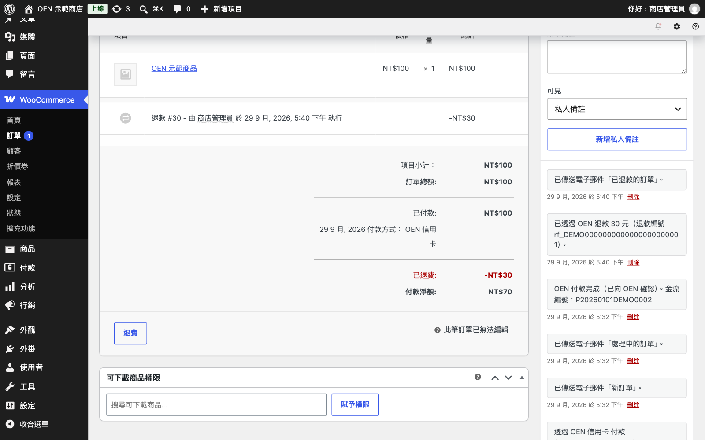

**已在應援後台退款時**

在應援後台「金流管理」的交易明細按「退款」，款項會退給消費者，但**不會**同步到 WooCommerce：訂單狀態與金額都不會改變。這時請在 WooCommerce 訂單按「退費」，輸入相同金額，改按「**手動退款**」，只補記錄。不要再按「透過 OEN 信用卡 退款」：應援可能回應錯誤，也可能再退一次款給消費者。

建議所有退款都從 WooCommerce 發起，兩邊的紀錄才會一致。

### 與應援交易紀錄對照

到應援後台 **金流管理 › 金流列表**，可以看到外掛建立的交易。

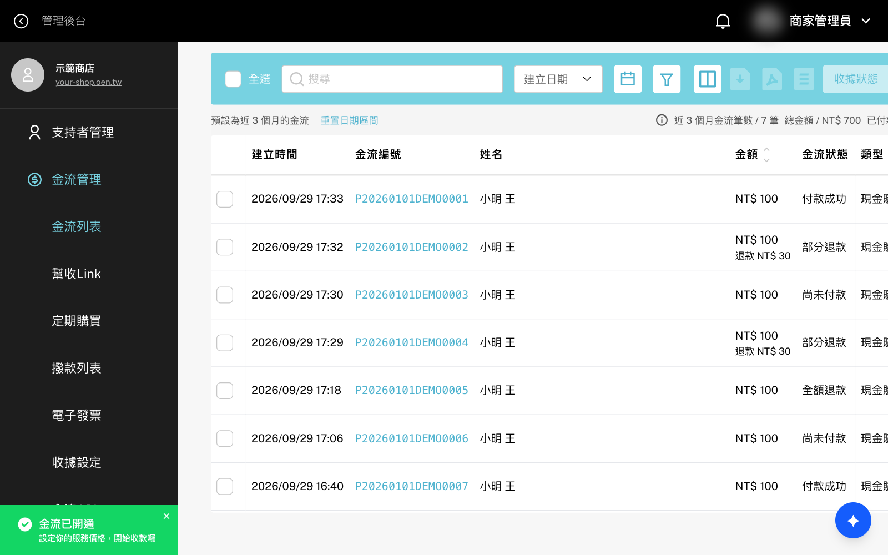

點進交易明細，對照方式：

| 應援後台 | WooCommerce |
|---|---|
| 金流編號 | 訂單標題下方的交易編號 |
| 訂單編號 | 「訂單編號前綴」加上 WooCommerce 訂單 ID。訂單 ID 預設與訂單編號相同，例如前綴設為 `WC-`、訂單 #21，就是 `WC-21`；沒有設定前綴時就是 `21`。使用自訂訂單編號的外掛時，以訂單 ID 為準 |
| 收取金額、金流狀態 | 訂單總額、訂單狀態 |

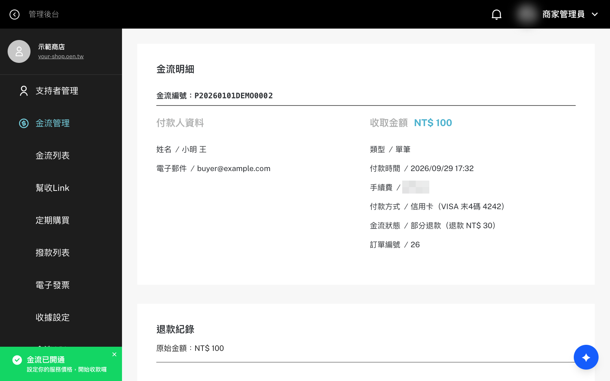

從 WooCommerce 退款後，明細的「金流狀態」會顯示「部分退款（退款 NT$…）」或「全額退款」，並在「退款紀錄」列出退款金額，處理人為 `system`。

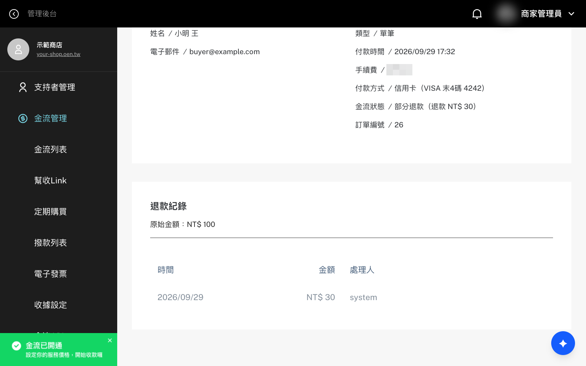

## 步驟 7：切換到應援正式環境

測試環境確認無誤後：

1. 取消勾選「OEN 測試環境」。
2. 將「商店代碼」與「Secret Key」換成應援**正式環境**的值（依[步驟 1](#步驟-1申請應援商店並取得憑證) 在正式環境的應援後台查看與產生）。
3. 勾選「Re-register webhook」。
4. 按「儲存設定」，確認畫面出現 Webhook 註冊或更新成功的訊息。

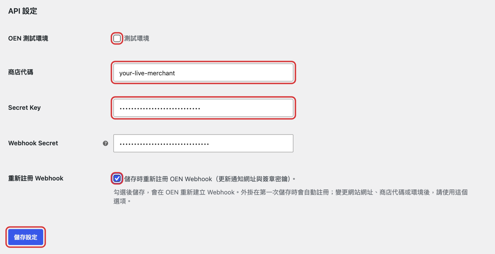

> **注意**
> - 一定要勾選「Re-register webhook」。一般儲存不會重新註冊 Webhook，應援正式環境的付款通知會送不到網站。
> - 商店代碼與 Secret Key 要換成應援正式環境的憑證，和「OEN 測試環境」的勾選狀態對應。
> - 「Re-register webhook」只作用一次，儲存後會自動取消勾選。
> - 之後若變更網站網址，也要勾選「Re-register webhook」重新儲存，外掛會為新網址另外建立一筆 Webhook。舊網址的 Webhook 不會被外掛刪除，如需移除請洽應援。

## 上線確認清單

- [ ] 「OEN 測試環境」已取消勾選，商店代碼與 Secret Key 都是應援正式環境的值。
- [ ] 儲存後出現「OEN webhook registered (…)」或「OEN webhook updated (…)」。
- [ ] WordPress 的網站網址（**設定 › 一般**）是從公網可以連線的網址，建議使用 HTTPS（Webhook 通知網址由它組成）。
- [ ] **WooCommerce › 狀態 › 已排程動作** 中沒有逾時未執行的 `oen_payment_info_sync`（超商繳費代碼需要排程）。
- [ ] 退款都從 WooCommerce 發起（在應援後台退款不會同步到 WooCommerce）。
- [ ] 網站隱私權政策已說明會把訂單資料傳送給應援（內容見 [README](../README.md#傳送給應援的資料)）。

## 需要協助

- 設定或付款狀態異常：先看[常見問題](faq.md)。
- 應援帳號、交易、帳務問題：[應援說明中心](https://oen.tw/support)、客服信箱 [info@oen.tw](mailto:info@oen.tw)。
- 外掛問題：[GitHub Issues](https://github.com/OEN-Tech/woocommerce-oen-payment/issues)。請附上 WordPress、WooCommerce、PHP 與外掛版本、問題畫面，以及 **WooCommerce › 狀態 › 日誌紀錄** 中 `oen-payment` 開頭的日誌，並先確認內容沒有 Secret Key、Webhook Secret 或消費者個人資料。
